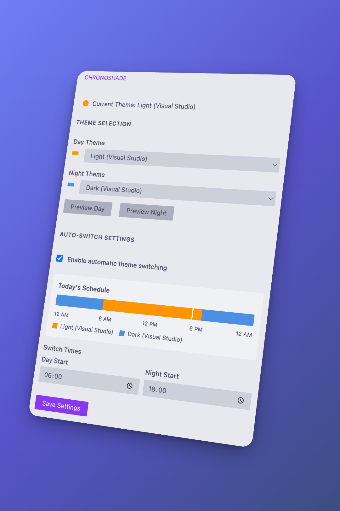

# ChronoShade

## Overview

ChronoShade automatically switches between light and dark themes based on sunset times, ensuring a seamless coding experience.

## Features

- **Automatic Theme Switching**  Changes themes dynamically based on sunset time.
- **Customizable Themes**  Select your preferred light and dark themes.
- **Sidebar UI**  Easily manage themes from the VS Code sidebar.

## Usage

- Open **ChronoShade** from the sidebar.
- Use the dropdown to select a theme.
- Click **Preview Theme** to test before applying.
- Enable **Auto-switch at Sunset** for automatic theme adaptation.

## Commands

- **Switch Theme** (`chronoShade.switchTheme`): Open a dropdown to select a theme.
- **Preview Theme** (`chronoShade.previewTheme`): Temporarily revert to the previous theme.
- **Toggle Sunset Auto-Switch** (`chronoShade.toggleSunset`): Enable or disable automatic theme switching.

## Supported Languages

ChronoShade is available in 15 languages:
- English
- Chinese (Simplified & Traditional)
- French
- German
- Italian
- Spanish
- Japanese
- Korean
- Portuguese (Brazil)
- Turkish
- Polish
- Czech
- Hungarian
- Bulgarian

## License

This project is licensed under the [MIT License](LICENSE).
