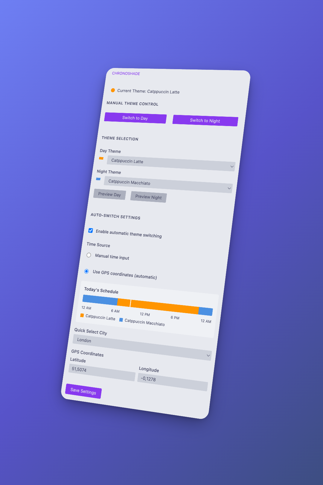

# ChronoShade

## Overview

ChronoShade automatically switches between light and dark themes based on sunrise/sunset times or custom schedules, ensuring a seamless coding experience that adapts to your daily rhythm.

## Features

- **Automatic Theme Switching**: Changes themes dynamically based on sunrise/sunset or custom times
- **Location-Based Times**: Automatically fetch sunrise/sunset times using GPS coordinates via the sunrisesunset.io API
- **Cron-Based Scheduling**: Define advanced day/night schedules with familiar cron expressions
- **Manual Theme Control**: Instantly switch between day and night themes with dedicated buttons
- **Customizable Themes**: Select your preferred light and dark themes from any installed theme
- **Intuitive Sidebar UI**: Easily manage all settings from the VS Code activity bar
- **Multi-Language Support**: Available in 15 languages with full localization
- **Visual Timeline**: See your daily theme schedule with a visual timeline indicator

## Usage

### Quick Start

1. Open **ChronoShade** from the sidebar (activity bar)
2. Choose your day and night themes from the dropdowns
3. **For Immediate Control**: Use "Switch to Day" or "Switch to Night" buttons for instant theme changes
4. **For Automatic Switching**: Enable automatic theme switching and choose between manual time input or GPS coordinates

### Smart Theme Management

ChronoShade intelligently manages your theme preferences:

- **Manual Override**: When you manually switch themes, automatic switching is disabled to respect your choice
- **Seamless GPS Integration**: Location-based times are fetched automatically during the save process
- **Clear Feedback**: You're always informed when settings change or automatic features are disabled

### Manual Theme Control

- Click **Switch to Day** to immediately apply your day theme
- Click **Switch to Night** to immediately apply your night theme
- **Smart Override**: Manual switching automatically disables automatic theme switching to prevent your selection from being overridden
- You'll be notified when automatic switching is disabled
- Use **Preview** buttons to test themes before saving (temporary, reverts after 5 seconds)

### Automatic Switching Options

#### Option 1: Manual Time Input

- Set custom sunrise and sunset times in 24-hour format (e.g., 06:00, 18:30)
- Perfect for consistent schedules or personal preferences

#### Option 2: Location-Based (GPS Coordinates)

- Enter your latitude and longitude coordinates
- **Automatic Fetching**: When you press "Save Settings" with GPS coordinates enabled, ChronoShade automatically fetches accurate sunrise/sunset times
- Uses the reliable sunrisesunset.io API
- Includes intelligent caching to minimize API calls
- No separate "Fetch Times" button needed - everything happens seamlessly when saving

#### Option 3: Cron Expressions

- Switch to the **Cron expressions** source in the sidebar to define day/night schedules with full cron syntax
- Provide standard 5-field cron expressions (minute hour day-of-month month day-of-week)
- Ideal for irregular routines like weekday-only schedules or multiple switches per day
- Manual times remain available as a fallback if a cron expression cannot be evaluated

## Commands

- **Switch Theme** (`chronoShade.switchTheme`): Open theme selection
- **Preview Theme** (`chronoShade.previewTheme`): Test themes temporarily

## Configuration

Access ChronoShade settings through VS Code Settings (Ctrl+,) and search for "ChronoShade":

- `chronoShade.dayTheme`: Theme to apply during the day
- `chronoShade.nightTheme`: Theme to apply at night
- `chronoShade.manualSunrise`: Manual sunrise time (24-hour format)
- `chronoShade.manualSunset`: Manual sunset time (24-hour format)
- `chronoShade.overrideThemeSwitch`: Enable or disable custom day/night times
- `chronoShade.useCronSchedule`: Enable cron-based scheduling instead of fixed times or location data
- `chronoShade.latitude`: Your latitude coordinate (-90 to 90)
- `chronoShade.longitude`: Your longitude coordinate (-180 to 180)
- `chronoShade.dayTimeStart`: Daytime start time (24-hour format)
- `chronoShade.nightTimeStart`: Nighttime start time (24-hour format)
- `chronoShade.dayCronExpression`: Cron expression that triggers the day theme
- `chronoShade.nightCronExpression`: Cron expression that triggers the night theme
- `chronoShade.useLocationBasedTimes`: Use GPS coordinates instead of manual times

## Supported Languages

ChronoShade is available in 15 languages:

- English
- Chinese (Simplified & Traditional)
- French
- German
- Italian
- Spanish
- Japanese
- Korean
- Portuguese (Brazil)
- Turkish
- Polish
- Czech
- Hungarian
- Bulgarian

## API Integration

ChronoShade uses the [Sunrise Sunset API](https://sunrisesunset.io/api/) to fetch accurate sunrise and sunset times based on your coordinates. The extension:

- Caches results daily to minimize API calls
- Gracefully falls back to manual times if the API is unavailable
- Respects your internet connection and privacy

## Privacy

- Your GPS coordinates are only used for sunrise/sunset calculations
- No personal data is collected or transmitted
- All settings are stored locally in VS Code
- API calls to sunrisesunset.io are made only when using location-based times

## License

This project is licensed under the [MIT License](LICENSE.txt).
